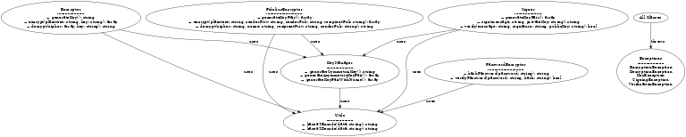

# SodiumCrypto – A Modern PHP Encryption Library (Fidelius Replacement)

[](https://www.php.net/)
[](LICENSE)
[]()

A lightweight, object-oriented encryption/decryption library built on PHP's [libsodium extension](https://www.php.net/manual/en/book.sodium.php).
It provides both **symmetric** and **asymmetric authenticated encryption** workflows (Fidelius-compatible), secure signing, password hashing, and utilities.

---

## ✨ Features
- ✅ Modern PHP 8.3+ OOP API
- ✅ Asymmetric Authenticated Encryption (Fidelius-like) with `sodium_crypto_box`
- ✅ Symmetric Encryption (secretbox) for fast, secure storage encryption
- ✅ Digital Signatures (signing and verification)
- ✅ Password hashing & secure password-based encryption
- ✅ Fully tested with PHPUnit 10+
- ✅ PSR-4 compliant and ready for Packagist

---

## 📦 Installation

```bash
composer require vendor/sodium-crypto
```

Ensure the PHP [Sodium extension](https://www.php.net/manual/en/book.sodium.php) is enabled (`php_sodium.dll` or built-in since PHP 7.2+).

---

## 🚀 Usage Examples

### 🔑 Generate Asymmetric Key Pairs
```php
use SodiumCrypto\Crypto\FideliusEncryptor;

$keys = FideliusEncryptor::generateKeyPair();

echo "Public Key: " . $keys['publicKey'] . PHP_EOL;
echo "Private Key: " . $keys['privateKey'] . PHP_EOL;
```

---

### 🔒 Asymmetric Encryption (Fidelius-style)
```php
use SodiumCrypto\Crypto\FideliusEncryptor;

// Sender encrypts
$encrypted = FideliusEncryptor::encrypt(
    "Hello Secure World",
    $senderPrivateKey,
    $senderPublicKey,
    $recipientPublicKey
);

// Recipient decrypts
$decrypted = FideliusEncryptor::decrypt(
    $encrypted['ciphertext'],
    $encrypted['nonce'],
    $recipientPrivateKey,
    $encrypted['keyToShare'] // Sender's public key
);
```

---

### 🔑 Symmetric Encryption
```php
use SodiumCrypto\Crypto\Encryptor;

$key = Encryptor::generateKey();
$cipher = Encryptor::encrypt("Secret Message", $key);
$plain  = Encryptor::decrypt($cipher, $key);
```

---

### ✍️ Digital Signatures
```php
use SodiumCrypto\Crypto\Signer;

$signKeys = Signer::generateKeyPair();
$signature = Signer::sign("Important data", $signKeys['privateKey']);

$isValid = Signer::verify("Important data", $signature, $signKeys['publicKey']);
```

---

### 🔑 Password Hashing
```php
use SodiumCrypto\Crypto\PasswordEncryptor;

$hash = PasswordEncryptor::hashPassword("SuperSecret");
$isValid = PasswordEncryptor::verifyPassword("SuperSecret", $hash);
```

---

## 🧪 Running Tests

```bash
composer install
vendor/bin/phpunit
```

All tests are defined in `tests/` and use PHPUnit 10+.

---

## 📂 Project Structure
```
src/
  Crypto/
    Encryptor.php
    FideliusEncryptor.php
    KeyManager.php
    Signer.php
    PasswordEncryptor.php
    Utils.php
  Exception/
    *.php
tests/
  Crypto/
    *.php
phpunit.xml
composer.json
```

---

## 🏗 Architecture

Below is the UML diagram representing the library's structure and relationships:



This diagram illustrates the core classes (`Encryptor`, `FideliusEncryptor`, `KeyManager`, `Signer`, `PasswordEncryptor`, and `Utils`) and how they interact.
Exception classes are thrown across all cryptographic components.

---

## 📜 License
MIT License – Use freely in commercial and open-source projects.

---

## 🤝 Contributing
Pull requests are welcome! Please run PHPUnit tests before submitting.
